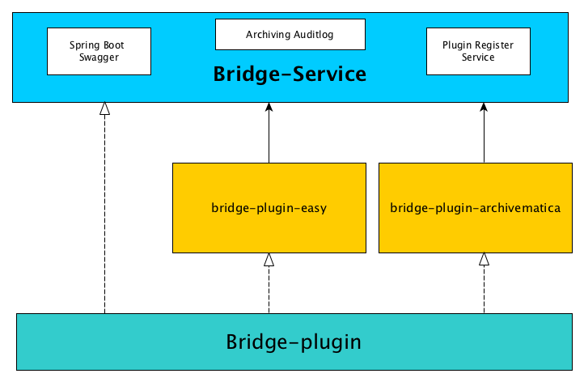
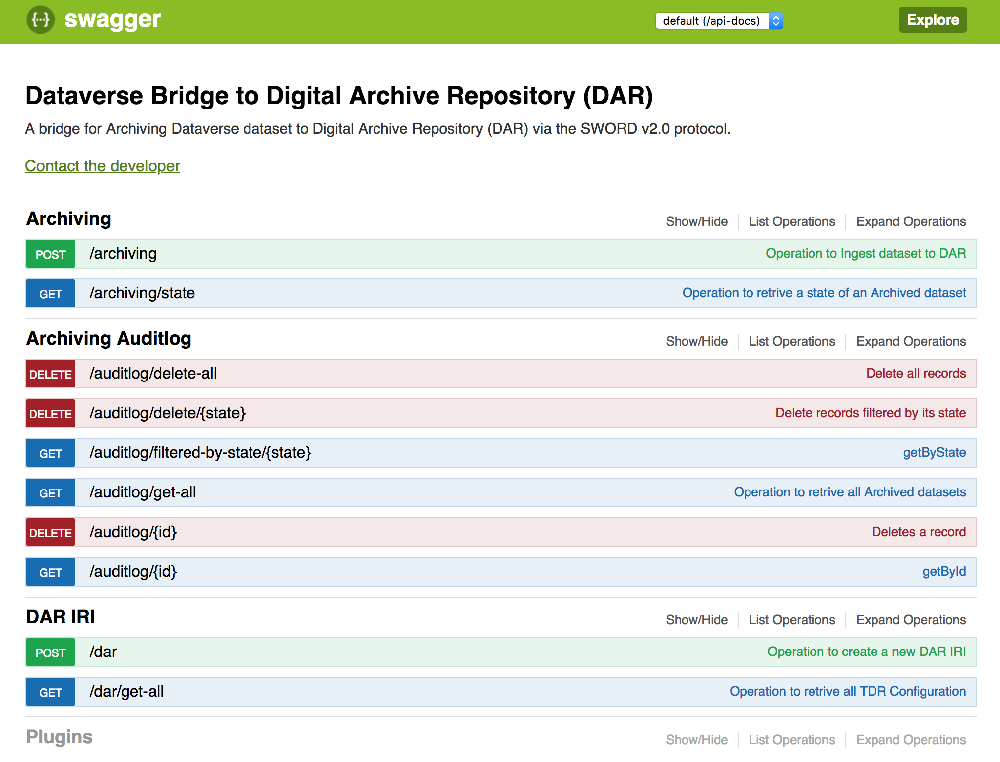
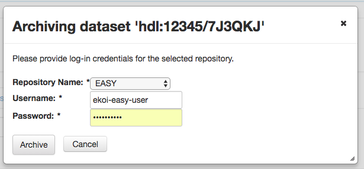

# Dataverse Bridge to Digital Archive Repository (DAR)


## Overview

The bridge service was developed in order to transfer datasets from a Dataverse instance to another Digital Archive Repository. At DANS, we will use the bridge to transfer datasets from DataverseNL to our long-term archive called EASY. The transfer is done by using the SWORD protocol (v2.0). 
DANS created a plug-in for EASY, but it is possible to create other plug-ins for the bridge service in order to transfer datasets from Dataverse to a repository of your choice. 
In the sections below more details are provided about:

-	[Architecture](#bridge-architecture)
-	[Changes needed in the Dataverse code](#dataverse-code)
-	[Setting up the bridge service](#bridge-service-setting)
-	[The EASY bridge plug-in](#bridge-plugin-easy)
-	[Creating your own plug-in](#creating-plugin)


## <a name="bridge-architecture"></a>Architecture



Due to modularity, flexibility and artifical separation purposes, the Dataverse Bridge application uses a simple plugin system architecture.
Thanks to the [Java reflection API](https://docs.oracle.com/javase/tutorial/reflect/) that allows [runtime type introspections](https://en.wikipedia.org/wiki/Type_introspection),
and [dynamic code loading](https://en.wikipedia.org/wiki/Dynamic_loading), the bridge-service will call plugin (eg: bridge-plugin-easy) without knowing all the details of plugin in advance. \
More details how to create a new plugin can be found [here](#creating-plugin)

The application consists of the following parts:
*  [bridge-plugin](#bridge-plugin)
*  [bridge-service](#bridge-service)
*  [bridge-plugin-easy](#bridge-plugin-easy)

### <a name="bridge-plugin"></a>bridge-plugin
The _bridge-plugin-_ mainly consist of interfaces that are used by the bridge-service to identify and treat all plugins the same way. The plugins need to implement the interfaces.

### <a name="bridge-service"></a>bridge-service

The bridge-service of Dataverse Bridge application is the host of application. The host application does not depend on the plugin implementation, only the plugin interface. 
Since to load a plugin requires knowing the class name of the plugin, the bridge-service read it from the supplied [plugin configuration](#bridge-plugin-structure).
The bridge-service was generated by the [swagger-codegen](https://github.com/swagger-api/swagger-codegen) project.
It uses [OpenAPI-Spec](https://github.com/swagger-api/swagger-core) to generate the server stub.

The underlying library integrating swagger to SpringBoot is [springfox](https://github.com/springfox/springfox)




## <a name="dataverse-code"></a>Changes needed in the Dataverse code
To enable "Archive" button on the dataverse side, additional _xhtml_, _java_ files and settings configurations are needed.





__Database Settings__

* _:DataverseBridgeConf_

Create a json (eg: dvn.json) file that contains the bridge url, the user group which permission to do archiving.
```
{
    "dataverse-bridge-url": "http://localhost:8592/api",
    "user-group": "SWORD",
    "conf":
        [
            {
                "darName": "EASY",
                "dvBaseMetadataXml": "https://test.dataverse.nl/api/datasets/export?exporter=ddi&persistentId="
             }
         ]
 }
```


```
curl -X PUT -d '/path-to/dvn.json' http://localhost:8080/api/admin/settings/:DataverseBridgeConf
```
__Dataverse Role Setting__

To be able to archive a dataset with Sword, the following conditions have been set:

* The user should be part of a group named 'SWORD'.
* The user should have an admin-role for the dataverse that contains the dataset that is going to be archived.

_Configuration_

Create a group 'SWORD' (alias 'SWORD') in the dataverse root.
Add the local admins to this group.
No need to give this group permissions (a role) on any dataverse or dataset level. It is also not necessary to create a new role for this group.

## <a name="bridge-service-setting"></a>Setting up the bridge service

#### How to generate:

```
swagger-codegen generate -i dataverse-bridge-api.yaml -l spring -o . -c dataverse-bridge-config.json\
 --import-mappings Archiving=nl.knaw.dans.dataverse.bridge.service.db.domain.ArchivingAuditLog

```

__.swagger-codegen-ignore__

```
pom.xml
src/main/java/nl/knaw/dans/dataverse/bridge/service/*
src/main/resources/application.properties
```

#### Start the Bridge Appication

Starting the server as an simple java application

Change default port value in application.properties

```
java -Dspring.profiles.active=dev -jar target/dataverse-bridge-0.5.0.jar

java -Dspring.profiles.active=dev -Xdebug -Xrunjdwp:transport=dt_socket,server=y,suspend=n,address=5105 -Xms128M -Xmx2G -jar dataverse-bridge-0.1.0.jar

```

You can view the api documentation in swagger-ui by pointing to
http://localhost:8592/api


**dar-target-conf**

*easy-dev.json*:
```
{
    "dar-name":"EASY",
    "iri":"http://deasy.dans.knaw.nl/sword2/collection/1"
}
```

###### <a name="bridge-plugin-structure"></a>Plugin Directory Structure
You can add the plugin to the plugins directory or you can upload it as zip file.\
The plugin must have the following structure:

```
easy (directory, must be in lowercase)
easy.json (json file that describe the plugin, see an example below)
-- lib (directory where the plugin.jar is located)
-- xsl (directory where the xsl files are located)

```

*easy.json*
```
{
  "dar-name": "EASY",
  "action-class-name": "nl.knaw.dans.dataverse.bridge.plugin.dar.easy.EasyIngestAction",
  "action-class-url": "lib/bridge-plugin-easy-0.5-SNAPSHOT-jar-with-dependencies.jar",
  "xsl":
        [
            {
                "xsl-name":"dataset.xml",
                "xsl-url":"xsl/dvn-ddi2ddm-dataset.xsl"
            },
            {
                "xsl-name":"files.xml",
                "xsl-url":"xsl/dvn-ddi2ddm-files.xsl"
            }
        ]
}
```


__application-dev.properties__

```
################## SPRINGFOX CONFIGURATION ##########################

springfox.documentation.swagger.v2.path=/api-docs
server.address=localhost
server.contextPath=/api
server.port=8592

################### Database Configuration ##########################
spring.datasource.url=jdbc:hsqldb:file:./database/bridgedb;sql.syntax_pgs=true
spring.datasource.username=sa
spring.datasource.password=


################### JavaMail Configuration ##########################
bridge.apps.support.email.from=
bridge.apps.support.email.send.to=eko.indarto@dans.knaw.nl
spring.mail.host=


################# Apps Configuration ##############################
bridge.dar.credentials.checking.timeout=3000
bridge.apikey=this!sMyAP1K3Y10122004
bridge.temp.dir.bags=/path/bagit-temp/bags
bridge.base.path.database.dir=
bridge.base.path.dar.target.conf.dir=
bridge.base.path.plugins.dir=

```
## <a name="bridge-plugin-easy">The EASY bridge plug-in
, which is the implementation of bridge-plugin for ingesting data to EASY repository
## <a name="creating-plugin"></a>Creating a plugin