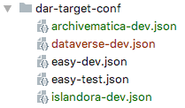

# Dataverse Bridge to Digital Archive Repository (DAR)


## Overview

The bridge service was developed in order to transfer datasets from a Dataverse instance to another Digital Archive Repository. At [DANS](https://dans.knaw.nl), we will use the bridge to transfer datasets from [DataverseNL](https://dataverse.nl) to our long-term archive called [EASY](https://easy.dans.knaw.nl/ui/home). The transfer is done by using the [SWORD](http://swordapp.org/) protocol (v2.0). 
[DANS](https://dans.knaw.nl) created a plug-in for [EASY](https://easy.dans.knaw.nl/ui/home), but it is possible to create other plug-ins for the bridge service in order to transfer datasets from Dataverse to a repository of your choice. 
In the sections below more details are provided about:

-	[Architecture](#bridge-architecture)
-	[Changes needed in the Dataverse code](#dataverse-code)
-	[Setting up the bridge service](#bridge-service-setting)
-	[The EASY bridge plug-in](#bridge-plugin-easy)
-	[Creating your own plug-in](#creating-plugin)


## <a name="bridge-architecture"></a>Architecture


Due to modularity, flexibility and artifical separation purposes, the Dataverse Bridge application uses a simple plugin system architecture.
Thanks to the [Java reflection API](https://docs.oracle.com/javase/tutorial/reflect/) that allows [runtime type introspections](https://en.wikipedia.org/wiki/Type_introspection),
and [dynamic code loading](https://en.wikipedia.org/wiki/Dynamic_loading), the bridge-service will call plugin (eg: bridge-plugin-easy) without knowing all the details of plugin in advance. \
More details how to create a new plugin can be found [here](#creating-plugin)

The application consists of the following parts:
*  [bridge-plugin](#bridge-plugin)
*  [bridge-service](#bridge-service)
*  [bridge-plugin-easy](#bridge-plugin-easy)

### <a name="bridge-plugin"></a>bridge-plugin
The _bridge-plugin-_ mainly consist of interfaces that are used by the bridge-service to identify and treat all plugins the same way. The plugins need to implement the interfaces.

### <a name="bridge-service"></a>bridge-service

The bridge-service of Dataverse Bridge application is the host of application. The host application does not depend on the plugin implementation, only the plugin interface. 
Since to load a plugin requires knowing the class name of the plugin, the bridge-service read it from the supplied [plugin configuration](#bridge-plugin-structure).
The bridge-service was generated by the [swagger-codegen](https://github.com/swagger-api/swagger-codegen) project.
It uses [OpenAPI-Spec](https://github.com/swagger-api/swagger-core) to generate the server stub.

The underlying library integrating swagger to SpringBoot is [springfox](https://github.com/springfox/springfox)


## <a name="dataverse-code"></a>Changes needed in the Dataverse code
To enable "Archive" button on the dataverse side, additional _xhtml_, _java_ files and settings configurations are needed.


__Database Settings__

* _:DataverseBridgeConf_

Create a json (eg: dvn.json) file that contains the bridge url, the user group which permission to do archiving.
```
{
    "dataverse-bridge-url": "http://localhost:8592/api",
    "user-group": "SWORD",
    "conf":
        [
            {
                "darName": "EASY",
                "dvBaseMetadataXml": "https://test.dataverse.nl/api/datasets/export?exporter=ddi&persistentId="
             }
         ]
 }
```


```
curl -X PUT -d '/path-to/dvn.json' http://localhost:8080/api/admin/settings/:DataverseBridgeConf
```
__Dataverse Role Setting__

To be able to archive a dataset with Sword, the following conditions have been set:

* The user should be part of a group named 'SWORD'.
* The user should have an admin-role for the dataverse that contains the dataset that is going to be archived.

_Configuration_

Create a group 'SWORD' (alias 'SWORD') in the dataverse root.
Add the local admins to this group.
No need to give this group permissions (a role) on any dataverse or dataset level. It is also not necessary to create a new role for this group.

## <a name="bridge-service-setting"></a>Setting up the bridge service

This [Quick start](#bridge-service-quickstart) shows how to deploy dataverse bridge by using the default properties.

Other way, step by step from generating the service, modification the port etc that can be followed from [here](#bridge-service-fullstart).


#### <a name="bridge-service-quickstart"></a>Quick start
Download [bridge-quickstart](bridge-quickstart.zip), unzip it in a folder.\
To start run on the terminal _start.sh_.\
To shutdown, execute _shutdown.sh_ command.

#### <a name="bridge-service-fullstart"></a>How to generate:
The dataverse bridge includes the Spring boot that provides a set of starter Pom’s build file, which includes an embedded Servlet Container.\
The following command, shows how to go from an OpenAPI spec ([dataverse-bridge-api](dataverse-bridge-api.yaml)) to generated Spring Boot server stub.

```
swagger-codegen generate -i dataverse-bridge-api.yaml -l spring -o . -c dataverse-bridge-config.json\
 --import-mappings Archiving=nl.knaw.dans.dataverse.bridge.service.db.domain.ArchivingAuditLog

```
Every time you run the code generation tool, it will overwrite the code it had generated previously. 
However, the generator tool offers a way of leaving certain files intact that is called .swagger-codegen-ignore file, which works just like a .gitignore file. 

__.swagger-codegen-ignore__

```
README.md
pom.xml
src/main/java/nl/knaw/dans/dataverse/bridge/service/*
src/main/resources/application.properties

```

#### Start the Bridge Appication

__Prerequisites__:

* _Java 8_\
The Dataverse Bridge appliation is build for java 8 and up.
* _application properties_:\
The Dataverse Bridge appliation loads properties from the application properties that located in _config_ directory of the current working directory.
The following properties are need to fill in application-dev.properties file:

```
################### Database Configuration ##########################
spring.datasource.url=jdbc:hsqldb:file:./database/bridgedb;sql.syntax_pgs=true
spring.datasource.username=sa
spring.datasource.password=
````
'./database/bridgedb' means that the in-memory hsql database will be created in the database directory of the current working directory.

````
################### JavaMail Configuration ##########################
bridge.apps.support.email.from=
bridge.apps.support.email.send.to=
spring.mail.host=


################# Apps Configuration ##############################
bridge.apikey=
bridge.temp.dir.bags=/path/bagit-temp/bags
````
For other environment, usually uses other profile-specific properties, eg: application-act.properties for acceptation server or application-prod.properties for production server. 
You can launch your application with a -D argument, such as _-Dspring.profiles.active=prod_ to launch the Dataverse Bridge application using application-prod.properties.


* _Log Directory_

The location of the log directory is configured on the application properties. As default, the log directory is located on the 'logs' directory of the current working directory.
```
################### Logging Configuration ##########################
logging.path=./logs
````

* _Digital Archive Repository Target_

The dar-target-conf is the directory where the configuration that contains the name and target URL of the Digital Archive Repository. The configuration has to provide as json file, eg: 
*easy-dev.json*:
```
{
    "dar-name":"EASY",
    "iri":"http://deasy.dans.knaw.nl/sword2/collection/1"
}
```


* _Plugins Directory_

In this directory, you can put your plugin. The plugin it self has certain structure that is describe [here](#bridge-plugin-structure).


##### Starting the application

Starting the server as an simple java application.\
The 'application-dev.properties' is used as indicate on '-D' argument: -Dspring.profiles.active=dev

```
java -Dspring.profiles.active=dev -jar target/bridge-service-0.5.0.jar

```
To start in the debug mode:
```

java -Dspring.profiles.active=dev -Xdebug -Xrunjdwp:transport=dt_socket,server=y,suspend=n,address=5105 -jar bridge-service-0.5.0.jar

```

You can view the api documentation in swagger-ui by pointing to
_http://localhost:8592/api_

##### Stopping the application

To shutdown the dataverse bridge application:
````
curl -X POST 'http://localhost:8582/api/admin/shutdown
````


## <a name="creating-plugin"></a>Creating a plugin

The plugin rely on the power of XSLT that is its ability to change the structure of XML in one format to other. 
In this case, it will transform the dataverse XML metadata (DDI, Dubli Core) or even Dataverse Metadata in JSON format to the desire Digital Archive Repository metadata.

Plugins must implements [IAction](https://github.com/ekoi/bridge-plugin/blob/master/src/main/java/nl/knaw/dans/dataverse/bridge/plugin/common/IAction.java) interface of the [bridge-plugin](https://github.com/ekoi/bridge-plugin). 

Include this dependency into your pom.xml to obtain the 0.5-SNAPSHOT release version of the bridge-plugin
````
<dependency>
    <groupId>nl.knaw.dans.dataverse.bridge.plugin</groupId>
    <artifactId>bridge-plugin</artifactId>
    <version>0.5-SNAPSHOT</version>    
 </dependency>
````

After creating the jar file from the project, the plugin can be uploaded (or deploy in the plugins directory of bridge-service) to the brige-service in the zip format.
The plugin must have the following <a name="bridge-plugin-structure"></a>__Plugin Directory Structure__:

```
easy (directory, must be in lowercase)
easy.json (json file that describe the plugin, see an example below)
-- lib (directory where the plugin.jar is located)
-- xsl (directory where the xsl files are located)

```


An example of *easy.json*
```
{
  "dar-name": "EASY",
  "action-class-name": "nl.knaw.dans.dataverse.bridge.plugin.dar.easy.EasyIngestAction",
  "action-class-url": "lib/bridge-plugin-easy-0.5-SNAPSHOT-jar-with-dependencies.jar",
  "xsl":
        [
            {
                "xsl-name":"dataset.xml",
                "xsl-url":"xsl/dvn-ddi2ddm-dataset.xsl"
            },
            {
                "xsl-name":"files.xml",
                "xsl-url":"xsl/dvn-ddi2ddm-files.xsl"
            }
        ]
}
```

## <a name="bridge-plugin-easy">The EASY bridge plug-in
The [bridge-plugin-easy](https://github.com/ekoi/bridge-plugin-easy) is the implementation of bridge-plugin for ingesting data to [EASY](https://easy.dans.knaw.nl/ui/home) repository.
This plugin, transform the Dataverse DDI metadata of the given persistent identifier to the EASY required xml files, those are dataset.xml and files.xml as describe on the '[Depositing in EASY with SWORD v2.0](https://easy.dans.knaw.nl/doc/sword2.html)' requirements document.


